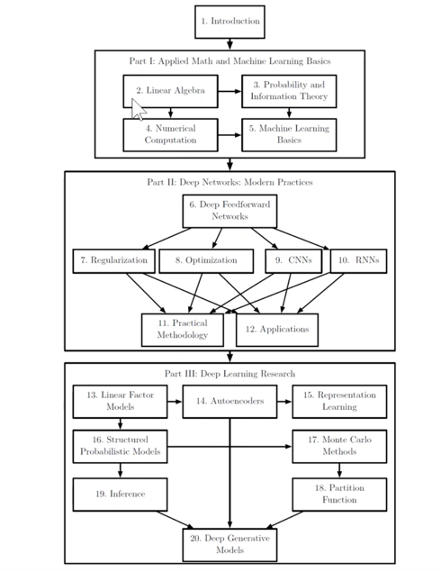
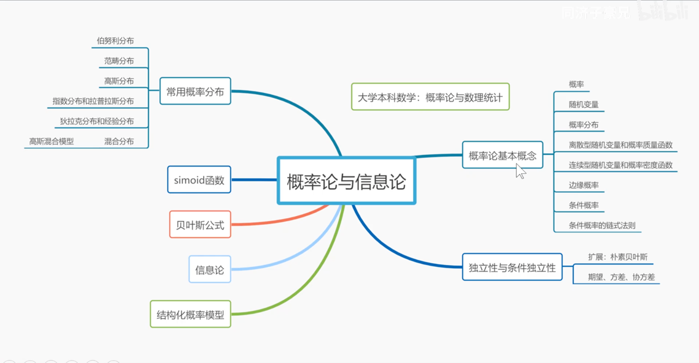
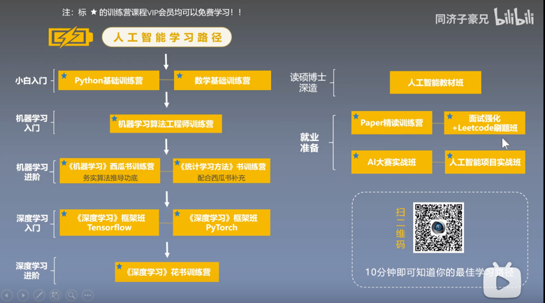

机器学习基础
    微积分：优化器-求导、微积分
    概率轮：神经网络多分类给出的都是概率。极大似然估计。
    线性代数：

《花书》
https://www.bilibili.com/video/BV1Gk4y1m7LQ?p=5

《数据集》
<波士顿房价>
<鸢尾花>
<MINIST>
<UCI/Kaggle 克利夫兰心脏病而分类数据集>

《斯坦福cs231n》
https://www.bilibili.com/video/BV1K7411W7So

《paper》
https://www.bilibili.com/video/BV1r7411X7LC